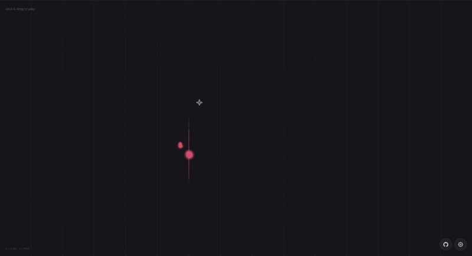

# Particle Synth




Interactive particle synth toy. Click or tap and drag to spawn particles that move, collide, and generate sound in real time.

* **X axis** → Quantized pitch (C minor pentatonic scale)
* **Y axis** → Filter cutoff (brightness)

This started as a small experiment in early 2025. I found it again and ended up improving it in one night. It triggers something inside of me and I hope it does the same for you.

### Features

* **Atmospheric audio** with built-in delay and feedback
* **Settings panel** via gear icon to tweak physics, trails, audio FX, and grid behavior
* **Musical typing**: notes are snapped to a scale so nothing sounds wrong

## Run with Docker

```bash
cp .env.example .env
# edit .env if you want a different port
docker compose up -d --build
```

Default port is `3000`. Set `PORT` in your `.env` to change it.

## Development

```bash
npm install
npm run dev
```

## Build manually

```bash
npm run build
```